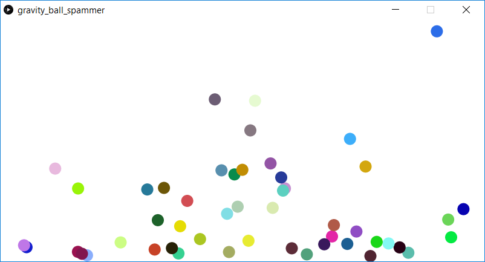

This program generates new bouncing balls orginating at the bottom center of the window. In this program, the balls are subject to y-axis gravity, and the balls are subject to some initial velocity vector on creation. Once the balls bounce some maximum number of times, or bounce off the screen, then new balls are generated.

Screenshot:  
